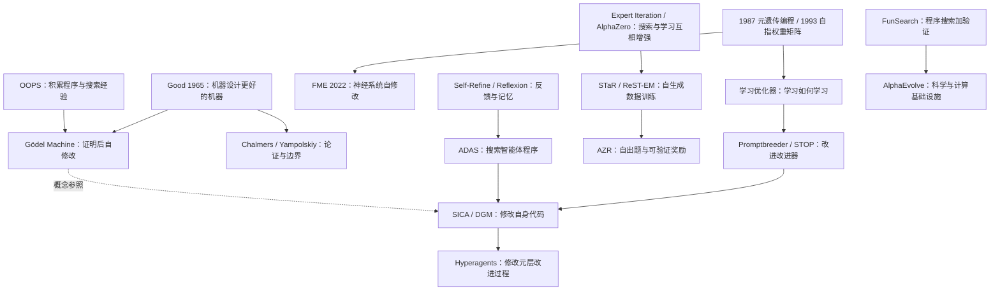

# RSI（递归自我改进）：经典论文、发展脉络与实践学习路线

> 研究对象：Recursive Self-Improvement，人工智能中的递归自我改进。  
> 整理与在线核对日期：2026-10-08。  
> 文献范围：1965—2026 年，26 篇主线论文，另附延伸文献、课程、代码和实验设计。  
> 适合读者：具备 Python、基本机器学习知识，希望从概念理解走向论文阅读与实验的学习者。

**快速导航：** [概念地图](#part-2) · [论文时间表](#part-3) · [理论奠基](#part-4) · [学习与自博弈](#part-5) · [现代自改进](#part-6) · [智能体自修改](#part-7) · [实验比较](#part-8) · [补充材料](#part-9) · [八周路线](#part-10) · [实践方案](#part-11) · [阅读卡片](#part-13)

<a id="part-1"></a>

## 1. 阅读前先明确：这份文档如何选文

RSI 不是一个边界完全统一的学科标签。早期研究集中在智能爆炸、通用程序搜索与自指系统；近年来的相关成果分散在元学习、强化学习、合成数据、程序搜索和智能体设计中。因此，本文选择的是一条**解释发展路径的阅读主线**，不是按引用量生成的排行榜，也不是穷尽全部论文的系统综述。

主线包含三类工作：

- **理论奠基**：提出问题、给出形式化框架或分析边界，如 Good、Gödel Machine。
- **关键技术与代表性实证**：解释自举为什么可能、怎样实现，如 Expert Iteration、STaR、STOP。
- **近期前沿**：连接到能够编辑自身程序或改进其改进过程的系统，如 SICA、DGM、Hyperagents。2025—2026 年工作尚不宜一概称为已经获得长期检验的“经典”。

排序优先采用**首次公开时间**，同时标注重要发表或修订版本。历史先后不等于直接继承关系；文中的路线图表达概念依赖，不主张所有作者之间存在明确的技术传承。

每篇论文都给出问题、贡献、实现机制、实验或理论结果、与 RSI 的关系及阅读重点。数值来自链接的原论文、作者主页或研究机构发布材料；本文没有运行这些论文的代码。纯理论论文会明确标注“无实证实验”。对图表中未可靠读出的数值，采用定性说明，不凭图形估读。

<a id="part-2"></a>

## 2. 概念地图：究竟是什么在“改进自己”

### 2.1 一个便于读论文的统一表示

把一个 AI 系统写成：

$$
S_t=(\theta_t,\,p_t,\,m_t,\,c_t,\,I_t,\,V_t)
$$

其中，$\theta$ 是模型参数，$p$ 是提示词，$m$ 是记忆，$c$ 是工具和工作流代码，$I$ 是产生改进的过程，$V$ 是评价候选的机制。不同论文修改其中不同的部分。

普通迭代优化可表示为 $S_{t+1}=I(S_t)$：改进器由人固定。更接近狭义 RSI 的系统则让改进能力也进入反馈环，例如 $S_{t+1}=I_t(S_t)$，并由系统自身产生后续 $I_{t+1}$。这只是本文的教学表示，不是所有论文共享的正式定义。

需要分别回答三个问题：

1. **对象是否变好？** 一次答案、某项技能或一个智能体的测试表现是否提高？
2. **改进过程是否变好？** 同等预算下，新系统是否更容易产生有效改进？
3. **这种能力能否继续迁移、累积？** 能否跨任务、跨代数持续，而非只适应同一个测试集？

第三个问题比第一个难得多。基准分数上升，不能单独证明改进速度正在加速。

### 2.2 常见机制的区别

| 机制 | 持续变化的对象 | 代表工作 | 与狭义 RSI 的距离 |
|---|---|---|---|
| 推理时自修正 | 当前答案、当前上下文 | Self-Refine | 一般没有永久更新改进机制 |
| 语言反馈记忆 | 跨尝试的反思文本 | Reflexion | 有经验积累，基础模型和更新规则通常固定 |
| 自生成数据训练 | 模型参数、训练样本 | STaR、ReST-EM | 形成自举闭环，但训练算法通常固定 |
| 自博弈 | 策略及对手/任务分布 | AlphaZero、AZR | 能产生课程，通常不改写学习程序 |
| 自我奖励 | 回答者与评价者能力 | Self-Rewarding LM | 评价环节也参与学习，需要独立校验 |
| 自指神经学习 | 包含更新机制的权重与动态状态 | 自指权重矩阵、FME | 让产生更新的机制也可变，外层选择仍有约束 |
| 改进提示词的提示词 | 任务提示、变异提示 | Promptbreeder | 在受限表示空间中改进改进器 |
| 自修改程序 | 工具、搜索器、智能体代码 | STOP、SICA、DGM | 具有程序层面的递归自改进证据 |
| 改进元层过程 | 如何分析、设计与产生下一代 | Hyperagents | 更直接检验“改进改进能力”，仍是有限实验 |
| 证明驱动的自修改 | 理论上可包含整个程序 | Gödel Machine | 提供形式化目标，实践可行性受证明搜索限制 |

**冻结基础模型不意味着系统没有发生改进；系统改进也不意味着基础模型权重变强。** 阅读时要以系统边界为准，并指出仍由人固定的模型、评估器、预算和外层控制逻辑。

### 2.3 发展路线图



不支持 Mermaid 的编辑器仍可直接阅读下面的时间表和逐篇解读。

<a id="part-3"></a>

## 3. 26 篇主线论文的时间顺序

| 编号 | 首次公开／重要版本 | 论文简称 | 在发展路径中解决的问题 | 阅读优先级 |
|---|---|---|---|---|
| [P01](#paper-01) | 1965 | Good：Ultraintelligent Machine | 为什么会产生递归改进的设想 | 必读 |
| [P02](#paper-02) | 1987 | Evolutionary Principles in Self-Referential Learning | 用程序进化改进程序进化 | 历史重点 |
| [P03](#paper-03) | 1993 | A Self-Referential Weight Matrix | 神经网络能否修改自身更新机制 | 历史重点 |
| [P04](#paper-04) | 2002／2004 | OOPS | 如何复用已发现程序，加速后续搜索 | 进阶 |
| [P05](#paper-05) | 2003 起／2007 章节 | Gödel Machine | 自修改何时可以被形式化地证明有益 | 必读 |
| [P06](#paper-06) | 2010 | Chalmers：The Singularity | 智能爆炸论证需要哪些前提 | 必读 |
| [P07](#paper-07) | 2015 | From Seed AI to Technological Singularity | RSI 定义与计算限制 | 进阶 |
| [P08](#paper-08) | 2016 | Learning to Learn by Gradient Descent | 能否学习参数更新规则 | 进阶 |
| [P09](#paper-09) | 2017-05 | Expert Iteration | 搜索增强策略，策略再增强搜索 | 必读 |
| [P10](#paper-10) | 2017-12／2018 | AlphaZero | 可验证环境中的大规模自举 | 必读 |
| [P11](#paper-11) | 2022-03 | STaR | 用自身生成的推理训练自身 | 必读 |
| [P12](#paper-12) | 2022／12 月 arXiv | Eliminating Meta Optimization（FME） | 减少对固定元优化器的依赖 | 必读 |
| [P13](#paper-13) | 2023-03-20 | Reflexion | 把失败转为可复用语言记忆 | 实践优先 |
| [P14](#paper-14) | 2023-03-30 | Self-Refine | 同一模型生成、批评、修改答案 | 实践优先 |
| [P15](#paper-15) | 2023-09 | Promptbreeder | 同时进化任务提示和变异提示 | 必读 |
| [P16](#paper-16) | 2023-10-03／2024 | Cannot Self-Correct Reasoning Yet | 排除反馈泄漏和不公平比较 | 必读 |
| [P17](#paper-17) | 2023-10-03／2024 | STOP | 用程序改进器改进改进器自身 | 必读 |
| [P18](#paper-18) | 2023-12-11／2024 | ReST-EM | 规模化生成、筛选、再训练 | 必读 |
| [P19](#paper-19) | 2023-12-14／2024 卷期 | FunSearch | 让程序搜索产生可检验的新结果 | 进阶 |
| [P20](#paper-20) | 2024-01 | Self-Rewarding Language Models | 让评价能力与回答能力共同更新 | 必读 |
| [P21](#paper-21) | 2024-08 | ADAS | 自动搜索智能体结构与工作流 | 必读 |
| [P22](#paper-22) | 2025-04 | SICA | 让编码智能体编辑自己的完整实现 | 前沿重点 |
| [P23](#paper-23) | 2025-05-06 | Absolute Zero | 自动产生训练题目与课程 | 前沿重点 |
| [P24](#paper-24) | 2025-05 公布／06 arXiv | AlphaEvolve | 优化算法与 AI 计算基础设施 | 前沿拓展 |
| [P25](#paper-25) | 2025-05-29 | Darwin Gödel Machine | 自修改与多分支进化档案结合 | 前沿重点 |
| [P26](#paper-26) | 2026-03 | Hyperagents | 显式修改产生下一代的元层过程 | 最新拓展 |

<a id="part-4"></a>

## 4. 阶段一：从智能爆炸设想到形式化自修改

<a id="paper-01"></a>

### P01｜Good（1965）：Speculations Concerning the First Ultraintelligent Machine

**文献信息。** I. J. Good，*Advances in Computers*，第 6 卷，31–88 页，1965。[出版记录与 DOI](https://doi.org/10.1016/S0065-2458(08)60418-0)；[Virginia Tech 收藏记录](https://vtechworks.lib.vt.edu/items/5085379d-b24c-424e-8861-e70a47b4b2fb/full)。后者是后来的存档/重印记录，不应把其存档年份当成论文发表年份。

**核心思路与贡献。** 如果机器在包括“设计机器”在内的智力活动上超过人类，它可能设计更强的后继机器；后继机器又可能继续改善设计能力。这是后来智能爆炸讨论最重要的思想起点之一，把 AI 视为潜在的 AI 研发者。

**实现方式。** 原文没有给出一个今天可以复现的 RSI 算法。它是关于超智能机器、学习、神经结构等问题的前瞻性讨论。教学上可将其抽象为“当前机器 → 设计后继机器 → 更强设计能力”，但这个抽象不是原文已实现的系统。

**结果与证据。** 无实证实验、没有性能曲线，也没有证明每一代一定更强。论文提供的是条件性论证和研究议程。

**局限与 RSI 定位。** 关键缺口是：一般任务能力是否转化为 AI 研发能力？设计出的改动能否验证？研发收益是否抵得过实验、算力和制造成本？后续文献主要是在逐步拆解这些缺口。

**阅读任务。** 用自己的话写出论证的前提，并为每个前提列出一种可能失败的情形。

<a id="paper-02"></a>

### P02｜Schmidhuber（1987）：Evolutionary Principles in Self-Referential Learning

**文献信息。** Jürgen Schmidhuber，慕尼黑工业大学 Diploma Thesis，副标题涉及 *On Learning How to Learn: The Meta-Meta-… Hook*。[作者资料与扫描件入口](https://people.idsia.ch/~juergen/diploma.html)；[论文扫描 PDF](https://people.idsia.ch/~juergen/diploma1987ocr.pdf)。它是历史学位论文，不应误标为现代期刊实验论文。

**核心思路与贡献。** 把遗传编程用于寻找更好的程序修改器，再把相同思想应用到更高层：不只进化解题程序，还进化产生程序的机制。这说明“学习如何学习”的递归设想远早于大模型时代。

**实现方式。** 前半部分构造元层遗传编程关系；后半部分讨论 PSALM 自指学习机制，让参与者具有创建、连接其他参与者及分配信用的动作，并通过信用分配表达收益和资源约束。

**结果与证据。** 这篇文献的主要价值是早期算法方案与结构设计。这里依据作者提供的原始扫描入口和章节说明整理，**未核实出可复述的标准化实验数值**，因此不列准确率或收敛倍数，也不将方案提出当作已经实现无界递归改进。作者资料页明确定位：第 7–13 页讨论元遗传编程，第 23–51 页讨论 PSALM。

**局限与 RSI 定位。** 多层元机制容易把人工设计问题向上转移；如何避免层次无限后退、如何评价改进器，后来仍是核心问题。有关“最早”“第一”的优先权说法需要更完整的历史比较，本文不依赖这些说法作结论。

**阅读任务。** 把遗传编程的“个体、变异器、适应度”分别对应到现代 STOP 的“程序、改进器、元效用”。

<a id="paper-03"></a>

### P03｜Schmidhuber（1993）：A ‘Self-Referential’ Weight Matrix

**文献信息。** Jürgen Schmidhuber，ICANN 1993，446–450 页。[作者提供的原文 HTML](https://people.idsia.ch/~juergen/selfref/selfref.html)。页面底部的 2003 年是网页制作/转换时间，不是论文发表年份。

**核心思路与贡献。** 一般神经网络的权重由外部固定算法更新；本文构造一种网络，使其能观察、分析并改变自己的权重，连负责产生权重更新的部分也进入可修改范围。它将自指改进落实到神经计算表示层。

**实现方式。** 通过专门的输入输出通道表示自身误差与权重信息，构造能读写自身权重矩阵的循环动态；再推导用于启动这一系统的梯度式序列学习算法。关键是同一参数系统既决定行为，又参与决定如何改变参数。

**理论结果。** 原文以构造性方式说明这类系统在原则上可以建立；重点是动态方程和初始学习规则，**没有给出可支撑现代大规模能力结论的基准实验**。作者明确将目标定位为可行性，而非获得最实用的优化算法。

**局限与 RSI 定位。** 计算复杂度高、误差曲面复杂、局部最优较多；具有自修改表达能力不等于能稳定发现好改动。与 2016 年学习型优化器相比，它更强调同一个网络对自身更新机制的显式控制。

**阅读任务。** 检查哪些变量由网络自身改变，哪些仍由初始算法控制；随后读 P12，理解参数共享和外层选择的作用。

<a id="paper-04"></a>

### P04｜Schmidhuber（2002／2004）：Optimal Ordered Problem Solver（OOPS）

**文献信息。** Jürgen Schmidhuber，2002 年预印本；期刊版见 *Machine Learning* 54，211–254，2004。[论文与版本记录](https://arxiv.org/abs/cs/0207097)；[全文](https://arxiv.org/pdf/cs/0207097)。

**核心思路与贡献。** 从头搜索每个程序很浪费。OOPS 把已经解决任务的程序保留下来，让后续搜索复用这些程序，并允许候选程序影响后续代码的搜索分布。它把增量学习和通用程序搜索放进同一框架。

**实现方式。** 系统按先验概率分配候选程序的运行预算；一条搜索支路扩展此前成功的程序，另一条搜索能够处理累计任务的程序。已接纳代码受到保护，新候选可调用或复制它们，再在可修改空间中组合、修改。验证器判断是否完成当前任务，成功后加入可复用库存。

**实验与结果。** 原文报告了渐进任务实验，系统利用先前较简单的形式语言任务经验，求解最多 30 个盘子的汉诺塔任务。理论贡献是相对于给定程序先验的搜索效率保证；这不是对任意现实任务都高效的结论。证据见论文摘要、算法分析及汉诺塔实验部分。

**局限与 RSI 定位。** OOPS 的外层通用搜索规则仍然固定；它更接近“积累可复用程序并改善搜索偏置”。其价值是说明改进不一定只存储在神经网络权重里，也可以存储在程序库和搜索经验中。

**阅读任务。** 画出“任务验证器、程序先验、运行预算、已解决程序库”四者之间的数据流。

<a id="paper-05"></a>

### P05｜Schmidhuber（2003 起）：Gödel Machines

**文献信息。** Jürgen Schmidhuber，*Goedel Machines: Self-Referential Universal Problem Solvers Making Provably Optimal Self-Improvements*，2003 年起的技术报告；相关 2007 年章节题名为 *Gödel Machines: Fully Self-referential Optimal Universal Self-improvers*。[预印本与修订记录](https://arxiv.org/abs/cs/0309048)；[作者资料页，含论文和讲解](https://people.idsia.ch/~juergen/goedelmachine.html)。

**核心思路与贡献。** 改动自己的代码之前，系统先搜索一个证明：执行这次改写的预期效用高于继续运行当前程序、继续寻找其他改写。证明搜索器本身也属于可以改写的程序。这使“自我改进”成为自指、可形式化分析的计算问题。

**实现方式。** 初始系统需要编码硬件与程序语义、环境假设和效用函数的公理；证明搜索器枚举候选证明技术；当找到满足切换条件的证明时，执行自修改。比较中必须计算搜索所需时间等成本，不能只比较理想化的新旧算法速度。

**理论结果。** 原文给出全局最优性意义的论证：在所采用公理、效用和可证明性条件下，已证明的切换优于继续搜索替代改写。**无现代基准上的实证提升结果。** “全局最优”不等于能有效找到所有好改动，更不等于存在能在有限时间找到的万能证明。

**局限与 RSI 定位。** 这是狭义 RSI 的核心理论参照。现实环境难以完全公理化，证明搜索可能极贵，有益改动可能无法在所用形式系统中证明。DGM 后来采用实验验证代替证明，因此不能直接继承这里的最优性保证。

**阅读任务。** 重点读效用、公理系统、目标定理与切换条件；解释为什么“新代码更快”还不足以触发正确的自修改。

<a id="paper-06"></a>

### P06｜Chalmers（2010）：The Singularity: A Philosophical Analysis

**文献信息。** David J. Chalmers，*Journal of Consciousness Studies* 17，7–65，2010。[作者提供的全文](https://consc.net/papers/singularity.pdf)；[作者 AI 研究资料页](https://consc.net/ai-and-computation/)。

**核心思路与贡献。** 将“达到人类水平 AI”“超过人类水平”“进一步发展成远超人类的 AI”拆成不同推论，分别讨论为什么可能成立，以及哪些阻碍会使其失败。它帮助读者区分能力提升的论证与“提升速度无限加快”的额外主张。

**分析方式。** 采用概念分析和条件论证，检查能力可扩展性、改进能力是否随任务能力提高、收益递减与外部障碍等问题，不提供训练算法。

**结果与证据。** 无实证实验。结果是对奇点论证、可能反对意见及后续哲学问题的系统分析，不是一个已证实的技术时间表。

**局限与 RSI 定位。** 讨论通常使用高度抽象的能力概念，难以直接对应 SWE-bench 准确率或每美元研发产出。阅读时应将其用作提出可检验问题的工具。

**阅读任务。** 将“更聪明会设计更聪明的系统”改写成一个可以进行对照实验的假设，明确输入预算和成功标准。

<a id="paper-07"></a>

### P07｜Yampolskiy（2015）：From Seed AI to Technological Singularity via Recursively Self-Improving Software

**文献信息。** Roman V. Yampolskiy，2015。[论文与版本记录](https://arxiv.org/abs/1502.06512)。

**核心思路与贡献。** 梳理自改进软件的定义、类型及相关研究，分析计算限制，并提出关于 RSI 行为和收敛的讨论框架。它适合在理论奠基之后阅读，用来检查“自我改进”一词是否在论证中偷换了含义。

**分析方式。** 讨论不同改进层次、软件理解与验证的难度、可计算性和资源限制，结合已有理论考察不断改进的可能边界。没有一个可直接部署并无限迭代的实现。

**结果与证据。** 无新的现代机器学习基准实验；主要产出是定义、综述和理论分析。作者关于收敛的框架不应被当作已建立的、适用于所有 RSI 系统的普遍定律。

**局限与 RSI 定位。** 论文早于大模型智能体时代，其具体技术背景已经变化，但“改进对象是什么、收益由谁判断、资源是否有限”这些问题仍然有效。不可判定性限制普遍算法，并不禁止在受限任务上获得有效改进。

**阅读任务。** 分别写出“不能保证改进所有程序”和“不能改进任何程序”的区别，避免把理论边界误读成全面否定。

<a id="part-5"></a>

## 5. 阶段二：学习更新规则与可验证环境中的自举

<a id="paper-08"></a>

### P08｜Andrychowicz 等（2016）：Learning to Learn by Gradient Descent by Gradient Descent

**文献信息。** Marcin Andrychowicz 等，2016。[论文](https://arxiv.org/abs/1606.04474)；[全文](https://arxiv.org/pdf/1606.04474)。

**核心思路与贡献。** 将优化器本身变为可学习对象。模型不只学习解决任务的参数，还学习“看到梯度以后，怎样更新参数”这一规则，是元学习与学习型优化器的代表作。

**实现方式。** 内层被优化参数为 $\theta$，外层优化器参数为 $\phi$：

$$
\theta_{t+1}=\theta_t+g_\phi(\nabla_\theta L(\theta_t),h_t).
$$

用 LSTM 读取梯度和历史状态并输出更新量；展开多步优化，对过程中损失构造元目标，再通过反向传播训练 $\phi$。论文使用共享的坐标级更新器以控制参数规模，外层训练包含截断展开。

**实验与结果。** 在二次函数、MNIST 小型网络和神经风格迁移等任务上，学习型优化器在相应分布内取得优于比较优化器的优化曲线。图 4 还展示：按 100 步训练的优化器能继续运行到 200 步。这是损失与收敛速度实验，不应虚构一个适用于所有任务的“统一准确率”。

**局限与 RSI 定位。** 外层优化算法和训练任务分布由人固定；跨架构、跨分布泛化不自动成立。因此它证明了“学习改进规则”的可行性，而不是完整的自主递归改写。

**阅读任务。** 在随机二次函数上做小实验，分开观察内层损失下降和元训练泛化，理解二者不是同一指标。

<a id="paper-09"></a>

### P09｜Anthony、Tian、Barber（2017）：Thinking Fast and Slow with Deep Learning and Tree Search

**简称。** Expert Iteration，ExIt。[论文](https://arxiv.org/abs/1705.08439)；[全文](https://arxiv.org/pdf/1705.08439)。

**核心思路与贡献。** 快速但较弱的神经策略与较慢但较强的搜索器互相增强：树搜索产生更好的决策，策略网络学习这些决策；更新后的网络又指导更强的搜索。它是理解后续“生成高质量监督 → 蒸馏回模型”方法的重要桥梁。

**实现方式。** 以蒙特卡洛树搜索产生专家策略分布；用监督学习让 apprentice 网络模仿它；下一轮把网络作为搜索先验，并可引入价值估计。这个专家不是固定的人类教师，而是随学习者共同进步。

**实验与结果。** 在 Hex 上优于文中 REINFORCE 训练基线。第 6.3 节报告：ExIt 与 MoHex 1.0 每步均进行 10,000 次搜索迭代时，ExIt 胜率为 **75.3%**；面对 100,000 次迭代的 MoHex，胜率为 **59.3%**。作者明确说明等迭代次数并不等于等运行时间，CPU/GPU 瓶颈不同。

**局限与 RSI 定位。** 学习和搜索形成闭环，但外层算法不自改写。效果依赖可模拟、可评价的环境和搜索资源。

**阅读任务。** 解释为什么同一个网络产生的搜索结果仍能成为比原策略更好的监督；与“直接把自己的原答案再训练一遍”比较。

<a id="paper-10"></a>

### P10｜Silver 等（2017／2018）：AlphaZero

**文献信息。** 2017 年预印本题名 *Mastering Chess and Shogi by Self-Play with a General Reinforcement Learning Algorithm*；2018 年 *Science* 论文题名 *A General Reinforcement Learning Algorithm That Masters Chess, Shogi, and Go Through Self-Play*。[2017 论文](https://arxiv.org/abs/1712.01815)；[2018 DOI](https://doi.org/10.1126/science.aar6404)；[作者团队对 2018 结果的介绍](https://deepmind.google/blog/alphazero-shedding-new-light-on-chess-shogi-and-go/)。

**核心思路与贡献。** 将自博弈、策略/价值网络与树搜索结合，从随机行为出发，在明确规则和胜负反馈下逐渐形成超强策略。它展示了无需人类棋谱标签的高质量自举，但“没有棋谱标签”不等于没有人为设计。

**实现方式。** 自博弈得到状态 $s$、搜索策略 $\pi$ 和最终结果 $z$；训练网络的策略头拟合 $\pi$，价值头拟合 $z$。常见的教学写法为：

$$
L=(z-v_\theta(s))^2-\pi^T\log p_\theta(s)+c\|\theta\|^2.
$$

新网络再参与搜索和自博弈。各棋种分别训练；“通用算法”不表示一个训练后的模型自动通吃所有棋种。

**实验与结果。** 2018 年完整评估中，国际象棋对 Stockfish 的 1,000 局比赛为 **155 胜、6 负，其余和棋**，并在将棋、围棋上击败对应强程序。这组结果属于 2018 年评估，不与 2017 预印本的赛制和成绩混用；不同系统硬件与搜索方式也不同。

**局限与 RSI 定位。** AlphaZero 改进策略，不自行发明其训练程序。棋类具备便宜且可靠的规则反馈，现实科研则常缺乏这样的评价器。

**阅读任务。** 用井字棋或小棋盘环境复现缩小版闭环，重点记录网络单独表现和“网络＋搜索”表现。

<a id="part-6"></a>

## 6. 阶段三：现代自指学习与大模型自改进机制

本阶段有两条并行支线：P12 延续神经网络自指学习，其他论文主要讨论大模型的反馈、合成数据和程序改进。按公开时间交错排列，便于看清它们并非同一种技术。

<a id="paper-11"></a>

### P11｜Zelikman 等（2022）：STaR: Bootstrapping Reasoning With Reasoning

**文献信息。** Eric Zelikman、Yuhuai Wu、Jesse Mu、Noah D. Goodman，NeurIPS 2022。[论文](https://arxiv.org/abs/2203.14465)；[核对用全文 v2](https://arxiv.org/html/2203.14465v2)；[作者代码](https://github.com/ezelikman/STaR)。

**核心思路与贡献。** 少量推理示范可以引导模型生成大量推理链，再用能得出正确答案的样本训练模型。对于答错的题，给出正确答案，让模型反向生成解释，即 rationalization，再加入训练。它把大模型已有能力转化为可累积的训练信号。

**实现方式。** 输入题目及少量推理示范 → 生成推理与答案 → 根据已知答案筛选 → 对失败题尝试答案条件化解释 → 用合格样本微调 → 重复。原始实现的迭代细节包括从基础模型进行微调，复现时不应擅自替换成无限连续训练而仍声称严格复现。

**实验与结果。** 原文表 1 在 CommonsenseQA **开发集**上报告：GPT-J 直接答案微调为 **60.0%**，STaR 不使用 rationalization 为 **68.8%**，加入后为 **72.5%**。表 2 的 GSM8K 测试准确率分别为直接微调 **5.8%**、STaR 加 rationalization **10.7%**。两个数据集、两个划分不能混作一个总体得分。

**局限与 RSI 定位。** 模型权重更新，但题目、正确答案及训练规则由外部提供。最终答案正确并不保证推理链正确，尤其是事后生成解释时可能学到合理化。属于参数层面的自举，不是改写学习算法。

**阅读任务。** 重点读算法、rationalization 消融、表 1–2；手工检查一些“答案正确但理由错误”的样本。

<a id="paper-12"></a>

### P12｜Kirsch、Schmidhuber（2022）：Eliminating Meta Optimization Through Self-Referential Meta Learning

**简称。** 本文提出 Fitness Monotonic Execution（FME）。Louis Kirsch、Jürgen Schmidhuber；初版见 2022 ICML DARL Workshop，arXiv 于 2022-12 提交。[论文](https://arxiv.org/abs/2212.14392)；[全文](https://arxiv.org/html/2212.14392)。

**核心思路与贡献。** 如果学习算法依然由固定的元优化器更新，人工设计依赖只是上移。本文让网络自己产生参数改变，由一个较简单的执行调度机制把更多计算分配给表现更好的候选，减少显式元优化的作用。

**实现方式。** 使用可通过外积读写自身权重的网络；候选运行时生成新权重与行为；把形成的候选保存在按适应度分桶的缓冲区；高适应度候选获得更高的执行概率。参数共享使同一机制可以反复作用于自身。改变怎么产生，主要由网络决定；哪些候选获得更多执行机会，仍由 FME 调度。

**实验与结果。** 第 4 节在双臂老虎机、CartPole 和非平稳老虎机上评估。约 **40 次自修改与选择**后学到始终选择高收益臂，与调参后的爬山法相当；CartPole 中自修改比比较爬山法改善更快，学得策略保持平衡约 **100 步**，图中汇总 **5 个随机种子**。非平稳老虎机里，把奖励作为输入后能适应好坏臂交换；去掉奖励输入则不能有效适应。

**局限与 RSI 定位。** 这是小规模神经自指改进证据，不是大模型结果；网络架构和执行调度仍固定。作者也承认 FME 是否应被视为一种极简元优化器存在语义讨论，因此题名不应理解成消除了所有外部设计。

**阅读任务。** 在相同环境交互预算下复现双臂老虎机，对照自生成更新与高斯扰动，明确何处体现了学习、元学习和选择。

<a id="paper-13"></a>

### P13｜Shinn 等（2023）：Reflexion: Language Agents with Verbal Reinforcement Learning

**文献信息。** Noah Shinn 等，NeurIPS 2023。[论文](https://arxiv.org/abs/2303.11366)；[作者代码与任务实现](https://github.com/noahshinn/reflexion)。

**核心思路与贡献。** 不立刻进行昂贵的权重更新，而是把任务失败的反馈转化为自然语言反思，写入记忆，下次尝试时读取。它说明持久状态和经验总结也可以承载改进。

**实现方式。** Actor 执行任务；Evaluator 产生成功、失败或其他反馈；Self-reflection 模块结合轨迹总结问题；下一轮 Actor 接收任务和历史反思。反馈可以来自环境、执行器，也可能由模型生成，来源必须分开记录。

**实验与结果。** 覆盖 ALFWorld、HotpotQA、HumanEval 等任务。论文报告 HumanEval **91% pass@1**，对照所引 GPT-4 成绩约 **80%**。这里的最终提交是在包含反馈和多次尝试的流程后得到的，不能把 91% 解读为一次无反馈调用的成功率，也不能忽略额外 token、测试和尝试成本。

**局限与 RSI 定位。** 更新的是反思记忆和后续决策上下文，模型权重不变，外层反思规则通常固定。错误反思也可能进入记忆并持续误导系统。

**阅读任务。** 从失败轨迹中区分“定位了原因的反思”和“只是重复应当更小心的建议”，再测试两者是否真的改变后续成功率。

<a id="paper-14"></a>

### P14｜Madaan 等（2023）：Self-Refine: Iterative Refinement with Self-Feedback

**文献信息。** Aman Madaan 等，2023。[论文](https://arxiv.org/abs/2303.17651)；[作者项目页](https://selfrefine.info/)；[代码](https://github.com/madaan/self-refine)。

**核心思路与贡献。** 同一大模型依次担任生成者、反馈者和修改者，在测试时反复完善答案。贡献在于给出通用、容易实现的反馈—修改流程，无需训练专门的纠错模型。

**实现方式。** 先生成 $y_0$，再计算文字反馈 $f_t=M(x,y_t)$，然后生成 $y_{t+1}=M(x,y_t,f_t)$，直到满足停止条件或耗尽轮次。各角色使用任务相关提示；所谓无需额外训练，不表示完全没有人工设计的提示和示例。

**实验与结果。** 在 7 类任务和 GPT-3.5、ChatGPT、GPT-4 等模型上，原文报告跨任务平均约 **20 个百分点的绝对提升**，评价包括人类偏好和自动任务指标。这不是同一考试上的统一准确率，更不是基础模型通用能力提高 20%。阅读项目页时还应核对其任务展示与论文版本。

**局限与 RSI 定位。** 改的是答案；没有把改进永久写回模型，也没有改进外层算法。正确性难以自行判断时，反馈可能把正确答案改错。需与下一篇反例论文配合阅读。

**阅读任务。** 在固定总调用预算下，比较自修正、独立多样本生成和多数投票，判断收益来自反馈还是额外计算。

<a id="paper-15"></a>

### P15｜Fernando 等（2023）：Promptbreeder: Self-Referential Self-Improvement Via Prompt Evolution

**文献信息。** Chrisantha Fernando、Dylan Banarse、Henryk Michalewski、Simon Osindero、Tim Rocktäschel。[论文](https://arxiv.org/abs/2309.16797)；[全文，重点表 1 与方法部分](https://arxiv.org/html/2309.16797)。

**核心思路与贡献。** 一般提示优化只改任务提示；Promptbreeder 还进化“如何修改提示”的变异提示。它把改进器的一部分也放入可搜索对象，是提示空间中相当直接的自指改进实例。

**实现方式。** 维护由任务提示和变异提示组成的种群；LLM 根据变异提示产生任务提示变体；在训练样本上计算适应度；选取进化单元进入后续代；部分操作同时更新变异提示。基础 LLM 权重冻结。

**实验与结果。** 论文表 1 中，PaLM 2-L 的 Promptbreeder 在 GSM8K 的 zero-shot 栏取得 **83.9%**，表列同基础模型 OPRO 为 **80.2%**，PS+ 为 **60.5%**。还评估了常识、算术和仇恨言论分类。这里 zero-shot 指任务推理提示形式，不表示优化阶段没有使用带答案的数据；跨方法预算也需另外核对。

**局限与 RSI 定位。** 已经涉及改进“产生改进的提示”，但种群机制、评价标准、变异操作框架仍由人设计。元提示变强不等于底层模型训练能力普遍提高。

**阅读任务。** 做一个固定变异提示的消融组，判断收益是否确实需要进化元提示，而不只是不断试不同任务提示。

<a id="paper-16"></a>

### P16｜Huang 等（2023／2024）：Large Language Models Cannot Self-Correct Reasoning Yet

**文献信息。** Jie Huang、Xinyun Chen、Swaroop Mishra 等，2023 预印本，ICLR 2024。[论文](https://arxiv.org/abs/2310.01798)；[核对用全文 v2](https://arxiv.org/html/2310.01798v2)。

**核心思路与贡献。** 检查仅凭模型自身判断进行纠错时，性能究竟是否提升。作者区分 intrinsic self-correction 与依赖标准答案判断是否继续修改的 oracle 设置，揭示外部正确性信号和预算不对等可能带来的高估。

**实现与对照。** 保持生成—反馈—修改流程，分别提供或去掉正确性标签；检查调用次数和初始提示质量；在 GSM8K、CommonsenseQA、HotpotQA 上进行比较。

**实验与结果。** 表 2–3：GPT-4 在抽样的 200 道 GSM8K 题上，标准提示 **95.5%**；提供 oracle 正确性反馈后为 **97.5%**；纯内在纠错第一轮 **91.5%**，第二轮 **89.0%**。这些结果支持的是特定模型与实验条件下的限制，不是对后来所有推理模型、所有纠错任务的永久不可能性证明。

**局限与 RSI 定位。** 这篇论文不是 RSI 构建方法，却是评估自改进证据必读的对照。它提醒我们：一个系统能够给出批评，不代表它能可靠判断何时应该改变答案。

**阅读任务。** 为自己的实验设计“正确改错率”和“错误改对率”两个指标，而不只统计最终准确率。

<a id="paper-17"></a>

### P17｜Zelikman 等（2023／2024）：Self-Taught Optimizer（STOP）

**完整题名。** *Self-Taught Optimizer (STOP): Recursively Self-Improving Code Generation*。Eric Zelikman、Eliana Lorch、Lester Mackey、Adam Tauman Kalai；2023 首发，COLM 2024。[论文](https://arxiv.org/abs/2310.02304)；[核对用全文 v3](https://arxiv.org/pdf/2310.02304v3)；[作者代码](https://github.com/microsoft/stop)。

**核心思路与贡献。** 先写一个调用 LLM 改善程序的改进器，再把这个改进器自己的源码交给它改善。评价候选改进器时，衡量它能在多个下游任务上产生多好的程序，而不是只看源码表面是否更复杂。

**实现方式。** 给定程序 $s$、效用 $u$ 和固定 LLM $L$，改进器输出 $I(u,s,L)$。将其平均下游表现定义为元效用：

$$
\hat U(I)=\frac{1}{|D|}\sum_{(u,s)\in D}u(I(u,s,L)),\qquad
I_{t+1}=I_t(\hat U,I_t,L).
$$

种子方法是多次采样后选优；进化出的策略包括树/束搜索、遗传方法和模拟退火式搜索。元效用包含资源约束，因此候选不能仅靠无限调用取得高分。

**实验与结果。** 图 4 以 learning parity with noise 为任务，5 次独立运行显示 GPT-4 下若干轮自改进提高平均测试元效用；GPT-3.5 和 Mixtral 设置反而退化。表 1 的跨任务迁移中，3SAT 的论文效用分数从种子改进器 **21.2%** 增至 **75.1%**，MaxCut 从 **58.7%** 增至 **74.2%**。这些是各任务定义的效用，不是通用智能分数。

**局限与 RSI 定位。** 作者明确说明基础语言模型未被改变，因此不是完整意义上的 RSI。它提供程序改进器自改写的实验证据，但每轮不保证单调改善，评价器与外层实验框架仍是关键外部条件。

**阅读任务。** 重点读元效用、算法 1、图 4 和迁移表；解释为什么“擅长优化下游代码”不必然意味着“擅长优化自己”。

<a id="paper-18"></a>

### P18｜Singh 等（2023／2024）：Beyond Human Data: Scaling Self-Training for Problem-Solving with Language Models

**简称。** ReST-EM，原文记作 ReST$^{EM}$。Avi Singh、John D. Co-Reyes、Rishabh Agarwal 等。[论文](https://arxiv.org/abs/2312.06585)；[核对用全文 v4](https://arxiv.org/html/2312.06585v4)。

**核心思路与贡献。** 以期望最大化的视角理解“生成多个候选 → 用外部正确性反馈筛选 → 训练模型”的闭环，并检验其规模化效果。它连接了早期 Expert Iteration 与现代合成数据训练。

**实现方式。** E 步用当前模型为每个问题采样，数学题用标准答案、代码题用测试用例给二元奖励；M 步用保留样本做监督训练。关键细节是每轮 M 步从基础预训练模型重新微调，以减轻任务过拟合；每题保留样本数设上限，防止简单题主导数据。

**实验与结果。** 在 PaLM 2 系列、MATH 与 APPS introductory 上优于仅用人类解答微调的比较设置。第 5.3 节中，PaLM 2-L 在 MATH 上三轮结果为 **41.9% pass@1**；一次生成三倍数据再训练为 **40.3%**。第 5.2 节的每题 64 样本多数投票准确率从基础模型 **44.02%** 升至 **48.82%**。后者不可与单次生成指标直接混比。

**局限与 RSI 定位。** 仍需要题目和可靠的结果验证；固定训练算法没有自行改善。论文观察到多轮可能过拟合，所以“迭代更多次”不是无限收益保证。

**阅读任务。** 在相同总样本预算下比较一轮大量生成与多轮少量生成，检验闭环迭代的独立价值。

<a id="paper-19"></a>

### P19｜Romera-Paredes 等（2023／2024）：Mathematical Discoveries from Program Search with Large Language Models

**简称。** FunSearch。Bernardino Romera-Paredes 等；2023-12-14 在线发表，*Nature* 625，468–475，2024。[期刊论文](https://www.nature.com/articles/s41586-023-06924-6)；[作者团队介绍](https://deepmind.google/blog/funsearch-making-new-discoveries-in-mathematical-sciences-using-large-language-models/)；[官方代码和已发现程序](https://github.com/google-deepmind/funsearch)。

**核心思路与贡献。** 让 LLM 生成求解程序，由可靠评价器筛选，并通过进化档案累积优秀候选。搜索的是可执行的构造规则或启发式函数，而不只是一个答案；这让发现更容易检查、解释和迁移。

**实现方式。** 人类提供程序骨架和评价函数；模型补全待优化函数；运行候选、评估得分；在分岛种群中保留有价值程序；把此前优秀程序放进提示继续产生变体。LLM 权重固定，主要变化发生在程序种群。

**实验与结果。** 在 cap set 问题上发现改进的构造和渐近下界，并在在线装箱问题上找到优于常用基线的启发式。官方论文补充材料 E.2 给出 $\mathbb Z_3^8$ 中 **512 个元素**的 cap set 构造；这是一项具体构造结果，不是证明该维度最大值，更不是完整解决 cap set 问题。实验包含约百万量级程序采样，不能视为一次简单问答的发现。[官方论文 PDF](https://storage.googleapis.com/deepmind-media/DeepMind.com/Blog/funsearch-making-new-discoveries-in-mathematical-sciences-using-large-language-models/Mathematical-discoveries-from-program-search-with-large-language-models.pdf)

**局限与 RSI 定位。** 它主要改善目标程序，没有展示外层搜索器持续自改写。其对 RSI 的关键启发是：可靠验证器可以将不稳定的生成能力转化为可累积的进步。

**阅读任务。** 从仓库运行一个已经发现的装箱启发式，先确认评价方式，再尝试小规模搜索，分开计算发现成本和使用成本。

<a id="paper-20"></a>

### P20｜Yuan 等（2024）：Self-Rewarding Language Models

**文献信息。** Weizhe Yuan、Richard Yuanzhe Pang、Kyunghyun Cho、Xian Li、Sainbayar Sukhbaatar、Jing Xu、Jason Weston。[论文](https://arxiv.org/abs/2401.10020)；[全文](https://arxiv.org/html/2401.10020)。

**核心思路与贡献。** 固定奖励模型可能成为能力瓶颈。该工作让语言模型既回答问题，又根据评价规则对候选答案评分，生成自己的偏好数据，并在后续训练中更新回答能力和评价能力。

**实现方式。** 从少量指令与评价示范建立种子模型；自生成提示和候选回答；通过 LLM-as-a-Judge 得到分数和偏好对；使用 DPO 训练下一阶段模型；再次生成偏好数据。M1、M2、M3 包含种子阶段和后续迭代，不能简单当作三次完全相同的 DPO 更新。

**实验与结果。** 基于 Llama 2 70B，论文表 1 的 AlpacaEval 2.0 指标——由 GPT-4 评价、相对 GPT-4 Turbo 的胜率——从 M1 的 **9.94%** 到 M2 的 **15.38%**、M3 的 **20.44%**。最后一个数字不是“超过 GPT-4 Turbo 的总胜率”，也不是通用准确率。作者同时指出回答变长，可能影响偏好评价，数学和逻辑推理并非所有类别都明显改善。

**局限与 RSI 定位。** 评价器参与更新使闭环更完整，但也可能形成自我认同与偏好漂移。它是训练和奖励能力的联动，还没有改写整个训练算法。

**阅读任务。** 将自评分与独立的人类/规则评价分开，检查自评分升高是否伴随真实质量提高，并控制回答长度。

<a id="part-7"></a>

## 7. 阶段四：从自动设计智能体到修改自身程序

<a id="paper-21"></a>

### P21｜Hu、Lu、Clune（2024）：Automated Design of Agentic Systems（ADAS）

**文献信息。** Shengran Hu、Cong Lu、Jeff Clune。[论文](https://arxiv.org/abs/2408.08435)；[核对用全文 v1](https://arxiv.org/html/2408.08435v1)；[代码](https://github.com/ShengranHu/ADAS)。

**核心思路与贡献。** 智能体的提示、角色分工和控制流程可以表示成代码，因此可以由元智能体自动设计。Meta Agent Search 利用已有设计档案和评估反馈，发现更好的目标智能体。

**实现方式。** 给元智能体提供任务、接口约束、历史候选和成绩；生成新智能体代码；测试、评价并归档；继续搜索新结构。与后来的 SICA 相比，这里的设计者和被设计者是分开的，元智能体本身保持固定。

**实验与结果。** 全文 v1 第 4.2 节采用 30 轮搜索，GPT-4 作为元智能体，GPT-3.5 运行候选与基线。表 1：DROP 的最佳发现智能体为 **79.4 F1**，对照最佳手工方法为 **65.8**；MGSM 为 **53.4%**，最佳手工比较方法为 **39.0%**。还评估了 MMLU、GPQA 及跨模型/跨任务迁移。不能将结果归因于目标模型权重训练，也不能忽略强元模型的贡献。

**局限与 RSI 定位。** 自动设计 AI 与 AI 递归改善自己的设计能力是两层问题。ADAS 建立了程序表示、搜索、归档和验证的工程基础，但固定元智能体限制了递归闭合程度。

**阅读任务。** 重现一个小搜索空间，并把“固定设计者”作为后续自修改实验的主要基线。

<a id="paper-22"></a>

### P22｜Robeyns、Szummer、Aitchison（2025）：A Self-Improving Coding Agent（SICA）

**文献信息。** Maxime Robeyns、Martin Szummer、Laurence Aitchison，2025。[论文](https://arxiv.org/abs/2504.15228)；[核对用全文 v2](https://arxiv.org/html/2504.15228v2)；[作者代码](https://github.com/MaximeRobeyns/self_improving_coding_agent)。

**核心思路与贡献。** 编码智能体的实现本身也是代码，可以作为自己的编辑对象。SICA 让承担任务的智能体同时承担自修改工作，减少固定元智能体与目标智能体之间的分离。

**实现方式。** 用普通 Python 表示智能体及其工具、上下文组织和调用逻辑；评估当前版本并保存表现；选择历史最佳版本读取实现和日志，生成下一版代码；再次评估。效用关注任务表现、成本和延迟。外部基础模型不做梯度更新。

**实验与结果。** 第 4 节选用固定的 **50 道 SWE-bench Verified** 题、50 道 LiveCodeBench 题及两个合成工具任务。15 轮实验主要使用 Sonnet 3.5 v2，部分推理角色使用 o3-mini。表 1 中 SWE-bench 子集从 **17%** 升到第 14 轮峰值 **53%**，第 15 轮为 **51%**；LiveCodeBench 从 **65%** 到第 15 轮 **71%**。原文该次运行 API 总费用约 **7,000 美元**，仅是历史实验成本，不是现在的复现报价。

**具体学到什么。** 论文记录了更高效的局部编辑工具、基于 AST 的符号定位等改进。模型基础能力不变时，工具和执行流程仍可产生可观收益。

**局限与 RSI 定位。** 这是程序层自修改的直接实证，但同一基准反复参与选择可能导致适应性过拟合；强推理任务上的额外增益也较有限。峰值与最终版本不同，恰好说明不能预设每一代都更好。

**阅读任务。** 对照表 1 检查每一代的收益、成本与时间，选择一个工具改动做单独消融，确认它是否是实际原因。

<a id="paper-23"></a>

### P23｜Zhao 等（2025）：Absolute Zero: Reinforced Self-play Reasoning with Zero Data

**简称。** Absolute Zero Reasoner，AZR。Andrew Zhao、Yiran Wu、Yang Yue 等。[论文](https://arxiv.org/abs/2505.03335)；[核对用全文 v1](https://arxiv.org/html/2505.03335v1)；[官方代码](https://github.com/LeapLabTHU/Absolute-Zero-Reasoner)。

**核心思路与贡献。** 将题目来源也放进学习闭环：模型自己提出有学习价值的任务，再尝试解决，由代码执行环境产生可验证反馈。它比只为固定人类题目生成解答的 STaR/ReST-EM 更进一步。

**实现方式。** 同一模型交替承担 proposer 与 solver。围绕“程序、输入、输出”三元组设计演绎、溯因和归纳任务；执行器检验任务有效性和答案；出题方获得与可学习性相关的奖励，解题方获得正确性奖励；通过强化学习更新模型。训练缓冲区提供课程历史。

**实验与结果。** 原文 v1 表 1 的 Qwen2.5-7B 系列比较中，AZR-Coder-7B 的代码平均分 **61.6**、数学平均分 **39.1**，两类平均的再平均为 **50.4**，较对应基础模型提高 **10.2 个百分点**。这个 50.4 不是把全部题目混在一起计算的总体准确率。评估覆盖 HumanEval+、MBPP+、LiveCodeBench v5 以及六个数学基准。

**局限与 RSI 定位。** “Zero Data”指这一步自博弈训练不依赖外部人工题目/标签，不是从没有预训练知识的模型开始。代码执行器、任务形式与奖励设计仍由人定义；它更新课程和模型参数，没有展示递归修改训练器源码。

**阅读任务。** 重点核对任务三元组、有效性筛选、出题奖励和表 1 的平均方式；分析系统会不会倾向产生大量简单重复题。

<a id="paper-24"></a>

### P24｜Novikov 等（2025）：AlphaEvolve: A Coding Agent for Scientific and Algorithmic Discovery

**文献信息。** Alexander Novikov、Ngân Vũ、Marvin Eisenberger 等；2025-05 公布白皮书，2025-06 提交 arXiv。[论文](https://arxiv.org/abs/2506.13131)；[作者团队发布页](https://deepmind.google/blog/alphaevolve-a-gemini-powered-coding-agent-for-designing-advanced-algorithms/)。

**核心思路与贡献。** 将程序进化扩展到较复杂的算法和真实计算系统，利用多个 LLM 产生代码修改，通过自动评估和进化数据库积累改进。与 RSI 最相关的是：被优化对象可包含训练 AI 所需的基础设施。

**实现方式。** 提供待优化代码和可计算指标；模型提出程序修改；分阶段评估正确性、速度或其他目标；保留多样的高质量候选，再基于这些候选生成下一批变体。有效评价器和问题工程化是整个流程的核心。

**实验与结果。** 论文报告找到两个 $4\times4$ **复数矩阵**相乘只需 **48 次标量乘法**的方案，改进这一设定下的既有构造；还报告了数据中心调度等实际应用。作者团队说明部署后的调度启发式平均回收约 **0.7% 的全球计算资源**。矩阵乘法数字是运算次数结果，资源回收数字是生产系统指标，两者都不能解释成基础模型推理准确率的提升。

**局限与 RSI 定位。** 优化 AI 训练基础设施，为“AI 帮助研发 AI”提供了实证方向；但这不等于已经展示了持续自主重训、发布更强基础模型，再由该模型产生更强改进器的完整闭环。目标程序、评价器和任务选择仍然重要。

**阅读任务。** 为每个应用分别列出“搜索对象、评价器、最后交付的程序、实际收益”，辨别算法发现与系统自修改。

<a id="paper-25"></a>

### P25｜Zhang 等（2025）：Darwin Gödel Machine: Open-Ended Evolution of Self-Improving Agents

**简称。** DGM。Jenny Zhang、Shengran Hu、Cong Lu、Robert Lange、Jeff Clune。[论文](https://arxiv.org/abs/2505.22954)；[核对用全文 v1](https://arxiv.org/html/2505.22954v1)；[官方代码](https://github.com/jennyzzt/dgm)。

**核心思路与贡献。** 用经验评估支持自修改，同时维护多个历史智能体构成的进化档案。暂时低分的版本也可能保留有用的新特征，成为以后改进的起点。它把自修改与多分支探索结合，试图避免只沿当前最佳版本贪心前进。

**实现方式。** 从档案选择父智能体；读取其表现与失败日志；由父智能体修改自身代码；执行分阶段评估；通过基本可用性检查后加入档案。基础模型冻结。原版的档案维护和父代选择外层过程仍固定，论文明确将其修改留作后续方向。

**实验与结果。** 80 轮实验中，自修改使用 Claude 3.5 Sonnet；SWE-bench 评估使用该模型，Polyglot 评估使用 o3-mini。第 4 节报告：

- **SWE-bench Verified 子集：20.0% → 50.0%。** 采用 10 题初筛、扩展至 60 题、强候选进一步评估至 200 题的策略；不是完整 500 题 Verified 榜单成绩。
- **Polyglot 的 50 题搜索子集：14.0% → 38.0%。**
- **完整 Polyglot 再评估：14.2% → 30.7%。** 论文使用的 pass@1 协议不给智能体看标准测试反馈，不可直接对照其他协议的 pass@2 排行榜。

去掉自改进或去掉开放探索的基线较弱。发现的改动包含精细编辑、上下文管理和复核流程等；“完整基准再评估”也不等于其中每道题都完全未参与此前搜索。

**局限与 RSI 定位。** 它没有继承 Gödel Machine 的形式最优性证明，也没有证明可无限进步。编码任务成绩是自修改能力的代理指标，二者是否同步提高仍需更直接的测试。

**阅读任务。** 重点读第 3 节、第 4.2–4.4 节和附录 B；追踪最佳智能体的祖先，观察中途退步为何仍可能通向有益改动。

<a id="paper-26"></a>

### P26｜Zhang 等（2026）：Hyperagents

**文献信息。** Jenny Zhang、Bingchen Zhao、Wannan Yang、Jakob Foerster、Jeff Clune、Minqi Jiang、Sam Devlin、Tatiana Shavrina，2026 年预印本。[论文与版本记录](https://arxiv.org/abs/2603.19461)；[全文](https://arxiv.org/html/2603.19461)；[官方代码](https://github.com/facebookresearch/Hyperagents)。这是前沿延伸，不能赋予它与长期经典相同的验证程度。

**核心思路与贡献。** DGM 利用“完成编码任务”和“编辑自身程序”都是编码这一关联；其他领域未必如此。Hyperagents 把任务智能体与元智能体整合到可编辑程序中，允许系统显式修改“如何产生下一代”的过程，从而更直接研究改进能力本身。

**实现方式。** 在 DGM 风格的档案搜索中，让候选同时包含任务执行逻辑和元层修改逻辑。系统可以改变历史表现分析、记忆与新候选生成方式。评价既检查目标任务，也考察元层改进能否迁移到新领域。

**实验与结果。** 涵盖编码、论文评审、机器人奖励设计，以及留作元评价的奥数解答评分。第 5 节报告每种方法 **5 次运行**，用中位数和 bootstrap 置信区间汇总。完整 Polyglot 上从 **8.4%** 提高到 **26.7%**，后者 95% 区间为 **23.1%–28.0%**。这与 DGM 的基线和统计方式不同，不能用最终 26.7% 与 30.7% 简单判断谁全面更强。论文还报告跨领域的改进过程迁移与跨运行累积。

**局限与 RSI 定位。** 比仅观察任务分数更接近检验“改进改进能力”，但仍是有限代数、有限任务、固定基础模型和外部评价条件下的实验。“潜在的自加速”与“已经证实无界加速”是不同强度的主张。

**阅读任务。** 重点读第 5.2–5.3 节与附录中的元评价指标；检查迁移时究竟复用了任务答案、任务程序，还是生成新程序的能力。

<a id="part-8"></a>

## 8. 横向比较：哪些证据能支持哪些结论

### 8.1 主要实验指标的正确读法

| 论文 | 指标与已核对结果 | 结果实际支持什么 | 不能直接推出什么 |
|---|---|---|---|
| OOPS | 汉诺塔最多 30 盘 | 增量程序复用可以帮助搜索 | 任意任务都能快速求解 |
| ExIt | 指定搜索迭代下胜 MoHex 75.3% | 搜索与学习可互相增强 | 与对手完全等硬件、等时间 |
| AlphaZero | 2018 棋赛 155 胜、6 负 | 规则环境下自博弈有效 | 通用系统已经自我重写 |
| STaR | CQA dev 60.0% → 72.5% | 自生成推理可改善训练 | 模型不需要外部答案 |
| Reflexion | HumanEval 报告 91% pass@1 | 反馈记忆辅助最终提交 | 一次无反馈生成有 91% 成功率 |
| 自纠错反例 | GPT-4 GSM8K 抽样 95.5% → 89.0% | 纯内在纠错可能退化 | 所有模型永远不能纠错 |
| STOP | GPT-4 有改进，较弱模型设置退化 | 自改进器依赖能力与任务条件 | 递归一旦启动就必然成功 |
| ReST-EM | 多轮 41.9%，单轮三倍数据 40.3% | 多轮反馈可能有额外价值 | 轮次越多越好 |
| Self-Rewarding | 相对特定参考模型胜率 9.94% → 20.44% | 自生成偏好可改善该评价表现 | 通用智能超越参考模型 |
| SICA | 50 题子集 17% → 峰值 53% | 自修改工具与流程有实效 | 完整榜单得分或每代单调提高 |
| AZR | 两域平均 50.4，提高 10.2 点 | 自出题 RL 能迁移到所测基准 | 完全不依赖预训练和人工环境 |
| AlphaEvolve | 48 次复数矩阵标量乘法 | 可验证算法搜索取得具体突破 | AI 训练与自身能力形成完整自动闭环 |
| DGM | 子集和完整 Polyglot 分别报告 | 档案探索与自修改有可测收益 | 获得 Gödel Machine 的证明保证 |
| Hyperagents | 多次运行及元层迁移 | 可实证研究改进能力的迁移 | 无界递归、自发智能爆炸 |

表中数字都来自各条目的对应来源和版本，不能横跨行作为同一排行榜。

### 8.2 四个逐渐增强的证据层次

以下层次是本文的阅读工具，不是领域统一评级标准。

1. **输出改进证据**：同一题的最终回答更好；Self-Refine 属于这一类典型机制。
2. **持久能力改进证据**：更新的模型、记忆或程序，在新题上更好；STaR、SICA 分别体现不同承载方式。
3. **改进过程改进证据**：固定预算与起点，更新后的改进器更容易发现有用变化；STOP、Hyperagents 直接触及这一层。
4. **跨任务、跨多轮的持续加速证据**：在控制额外计算、选择偏差和任务变化后，研发收益率仍能累积提高。本文列出的有限实验不足以单独确立普遍、无界的这一结论。

一个实用的研究指标是：

$$
\text{改进效率}=\frac{\text{独立验证集上的能力增益}}{\text{搜索、验证和训练的总成本}}.
$$

这是建议指标，不是上述论文统一使用的公式。对于能力已经接近饱和的任务，还应观察达到固定分数所需成本，而不只观察最终分数。

### 8.3 最容易混淆的六件事

- **准确率与 pass@k。** pass@k 衡量 k 个候选中至少一个正确；若实际部署没有可靠选择器，它不等于最终可交付答案的正确率。
- **推理时预算与学习收益。** 多轮调用更好，可能只是用了更多搜索；需比较相同预算的独立采样基线。
- **峰值与可靠收益。** 从大量候选中选出的最好版本可能包含选择偏差；应重复运行并做独立再评价。
- **开发集与测试集。** 反复根据某个“测试集”调参，会使它事实上成为开发集；命名不能阻止泄漏。
- **评价器得分与真实任务价值。** 模型裁判可能偏爱长度或风格；能通过有限测试的代码也可能不满足完整规格。
- **档案里的最好分数与系统进化速度。** 只要保留历史最好值，曲线就不会下降；这本身不是递归加速的证据。

这些问题可以用 P16 的对照实验、P22 的逐代分数表，以及 P25 的分阶段评估设置来练习识别。

<a id="part-9"></a>

## 9. 补充论文与学习材料

### 9.1 五篇值得搭配阅读的文献

这些是支撑主线理解的补充材料，不计入前面的 26 篇。

| 材料 | 核心内容、实现或结果 | 适合搭配 |
|---|---|---|
| Rafailov 等，2023，[Direct Preference Optimization: Your Language Model is Secretly a Reward Model](https://arxiv.org/abs/2305.18290) | 将偏好对转化为直接优化语言模型的目标，减少传统 RLHF 流程的复杂性；原文在情感控制、摘要和单轮对话等任务上评估。它解释 Self-Rewarding 中的 DPO 更新，但本身不是 RSI。 | P20 前置阅读 |
| Gulcehre 等，2023，[Reinforced Self-Training (ReST) for Language Modeling](https://arxiv.org/abs/2308.08998) | 交替扩大模型生成数据集与使用离线强化学习改善策略；在机器翻译设置中报告质量提升。与 ReST-EM 的区别包括奖励形式、数据混合和每轮训练起点。 | P18 的历史前驱 |
| Shumailov 等，2024，[AI Models Collapse When Trained on Recursively Generated Data](https://www.nature.com/articles/s41586-024-07566-y) | 通过理论模型以及 GMM、VAE、语言模型实验，说明不加区分地递归使用模型生成数据可能丢失原分布尾部并退化。其条件不等同于“外部正确性验证＋多样性控制＋保留真实数据”的所有自训练方案，不能据此断言所有合成数据必然失败。期刊页标有后续更正，应阅读更新版本。 | P11、P18、P23 的反向检验 |
| Chen、Wang、Qu，2026，[Recursive Self-Improvement in AI: From Bounded Self-Refinement to Autonomous Research Loops](https://arxiv.org/abs/2607.07663) | 近期综述，按改进对象和闭环程度梳理研究，并强调评价信号。适合作为继续发现论文的索引；它是二级综述，具体实验结论仍应回到原论文。 | 读完主线后扩展视野 |
| Roesner、Kohno，2026，[Reflections on Trusting Trust, Revisited: Contaminating Self-Modifying AI Coding Agents with Poisoned Benchmarks](https://arxiv.org/abs/2609.17817) | 以 DGM、SICA、Hyperagents 为实验对象，研究受到污染的评价基准如何影响后续自修改版本；原文报告概念验证，并观察到某些污染会在转用干净基准后持续。这说明评价器的可信性本身就是自改进实验的一部分；它不是对所有部署系统的普遍攻击成功率估计。 | P22、P25、P26 的评价边界 |

### 9.2 课程与教材

| 材料 | 建议学习内容 | 对应主线 |
|---|---|---|
| [Sutton 与 Barto：Reinforcement Learning, 2nd ed.](https://mitpress.mit.edu/9780262039246/reinforcement-learning/) | 多臂老虎机、MDP、策略迭代、价值估计、策略梯度；先理解奖励和策略评估，再讨论自博弈 | P09、P10、P12、P23 |
| [David Silver 强化学习课程资料](https://davidstarsilver.wordpress.com/teaching/) | 按课程顺序学习 MDP、动态规划、无模型控制、函数逼近和策略梯度，结合棋类例子理解搜索与学习 | P09、P10 |
| [Stanford CS330：Deep Multi-Task and Meta Learning](https://cs330.stanford.edu/) | 任务分布、内外层优化、元学习、课程与持续学习；这里链接的是公开课程资料，不承诺正在开课或所有录像无需登录 | P08、P12 |
| [Dive into Deep Learning](https://d2l.ai/) | 自动微分、优化、循环神经网络、注意力和训练实践；基础薄弱时先补这部分 | P03、P08、P11、P18 |
| [Gödel Machine 作者资料页](https://people.idsia.ch/~juergen/goedelmachine.html) | 原始论文、不同版本、FAQ 与相关理论索引；注意作者回顾文章中的历史优先权主张需要独立比较 | P04–P07 |

### 9.3 代码与可运行材料索引

下表列出论文作者或相关项目官方提供的入口。链接存在或由原论文明确给出，不等于本文已运行仓库，也不保证旧模型 API 仍然可用；精确复现应保存提交号和模型快照。

| 项目 | 官方/作者入口 | 推荐第一步 | 资源特点 |
|---|---|---|---|
| OpenSpiel | [google-deepmind/open_spiel](https://github.com/google-deepmind/open_spiel) | 先跑小型博弈与搜索示例，理解自博弈评估 | 小任务可用普通电脑；不是原始 AlphaZero 全规模复现 |
| STaR | [ezelikman/STaR](https://github.com/ezelikman/STaR) | 读数据生成和答案筛选流程 | 原实验训练成本较高，小模型/LoRA 属于改编复现 |
| Reflexion | [noahshinn/reflexion](https://github.com/noahshinn/reflexion) | 找一个任务，追踪反馈写入与读取 | 通常不需微调，但多次调用有成本 |
| Self-Refine | [madaan/self-refine](https://github.com/madaan/self-refine) | 对照 generator、feedback、refine 三种提示 | 适合第一个大模型闭环实验 |
| STOP | [microsoft/stop](https://github.com/microsoft/stop) | 先定位 seed improver 和 meta-utility | 元评价会放大嵌套调用成本 |
| FunSearch | [google-deepmind/funsearch](https://github.com/google-deepmind/funsearch) | 先验证已发现构造和启发式，再尝试搜索 | 验证既有结果通常比重新发现便宜 |
| ADAS | [ShengranHu/ADAS](https://github.com/ShengranHu/ADAS) | 读元提示、候选档案和任务评价 | 适合构建固定设计者基线 |
| SICA | [MaximeRobeyns/self_improving_coding_agent](https://github.com/MaximeRobeyns/self_improving_coding_agent) | 先读智能体结构和逐代实验记录 | 完整实验涉及强模型和较多评估 |
| AZR | [LeapLabTHU/Absolute-Zero-Reasoner](https://github.com/LeapLabTHU/Absolute-Zero-Reasoner) | 先验证出题—执行—判分管线 | 完整 RL 训练需要较高算力 |
| DGM | [jennyzzt/dgm](https://github.com/jennyzzt/dgm) | 读自修改入口、档案选择、分阶段评估 | 多代搜索和仓库级任务成本较高 |
| Hyperagents | [facebookresearch/Hyperagents](https://github.com/facebookresearch/Hyperagents) | 对照 task agent 和 meta agent 的可编辑边界 | 跨域实验还涉及环境与统计重复 |

AlphaEvolve 的论文和官方材料适合研究系统结构与已报告成果；本文没有把名称相似的第三方实现当成其完整官方复现代码。

<a id="part-10"></a>

## 10. 建议的八周学习路线

这里的周数是学习安排，不是性能承诺。每周约 6–10 小时可完成阅读和小实验；训练型论文的完整复现通常需要额外时间和计算资源。

| 周次 | 核心阅读 | 学习目标 | 建议产出 |
|---|---|---|---|
| 第 1 周 | P01、P05、P06，浏览 P02–P04 | 区分思想论证、可计算构造、经验结果 | 一页 RSI 定义表；每篇列出固定与可变部分 |
| 第 2 周 | P08、P09、P10 | 掌握内外层学习、搜索和自博弈 | 井字棋搜索/学习小实验，绘制学习曲线 |
| 第 3 周 | P03、P12、P11 | 区分神经自修改与自生成数据训练 | FME 双臂老虎机或 STaR 数据筛选原型，二选一 |
| 第 4 周 | P13、P14、P16 | 学会严格评估反馈和自纠错 | 等预算比较：直接生成、多样本、自修正、反馈记忆 |
| 第 5 周 | P15、P17 | 理解“改进改进器”的具体表示 | 小规模提示进化或 STOP 式程序改进器 |
| 第 6 周 | P18、P20、P23，加 DPO/ReST 补充 | 理解数据、评价与课程的闭环 | 设计一套带外部验证的合成数据流程，检查错误与重复 |
| 第 7 周 | P19、P21、P22、P25 | 理解程序档案与智能体自修改 | 完成一个固定元智能体与自修改版本的对照设计 |
| 第 8 周 | P24、P26，回看 P07 与反例材料 | 判断改进能力是否迁移与累积 | 一份实验报告，含成本曲线、失败分析和跨任务测试 |

如果时间有限，优先读这条 12 篇路径：**P01 Good → P05 Gödel Machine → P09 ExIt → P11 STaR → P12 FME → P15 Promptbreeder → P16 自纠错反例 → P17 STOP → P21 ADAS → P22 SICA → P25 DGM → P26 Hyperagents**。它保留了理论、神经自指、大模型方法和智能体自修改四条关键线索。

<a id="part-11"></a>

## 11. 从学习走向实验：一个可检验的最小方案

以下是本文提出的教学实验设计，不是某篇论文的逐行复现，也没有在本次整理中执行。

### 11.1 先选择有客观反馈的小任务

适合起步的对象包括小型算法题、装箱启发式、明确规格的字符串变换、限定工具接口的编码任务。先建立可信评价器，再增加递归层次。若从开放式文章质量直接开始，很难分清进步来自质量、长度还是裁判偏好。

至少分开三组任务：

- **改进集**：允许系统读取任务、运行结果和失败日志，用于产生修改。
- **选择集**：用于比较候选和确定交付版本；反复使用会造成适应性过拟合，因此仍不等于最终测试。
- **锁定测试集**：搜索结束后评估；不把逐题答案、测试实现或结果反馈给正在进化的系统。进一步研究时另设跨领域测试。

改动边界可以先限定为一个明确目录中的工具与调度代码，保留评估器、数据划分、预算计数和日志机制的独立性。这里的独立性是为了让实验成绩有意义。

### 11.2 三组必要对照

| 对照 | 配置 | 能回答的问题 |
|---|---|---|
| A：固定系统 | 不修改智能体，用相同总预算完成任务 | 收益是否只是多用计算？ |
| B：固定改进器 | 始终由初始改进器提出修改，保留同样的评价和档案预算 | 目标程序搜索已经足够，还是需要递归？ |
| C：自改进器 | 后续改进由更新过的系统参与生成 | 让改进器演化是否带来额外价值？ |

进阶实验再比较单一路径与多样化档案、固定评价器与学习评价器。一次实验尽量只改变一个关键因素，否则无法解释原因。

### 11.3 框架伪代码

```python
# 教学伪代码：dev_suite、selection_suite、locked_test 均由外部定义。
# 成本统计包括候选生成、程序执行、评估和重试。

archive = [immutable_snapshot(seed_agent)]
history = []

for generation in range(max_generations):
    parent = select_parent(archive, history)

    candidate = run_with_budget(
        agent=parent,
        task=make_self_modification_task(parent, history),
        editable_copy=copy_agent_code(parent),
    )

    if not interface_and_editability_checks(candidate):
        record_failure(candidate)
        continue

    score, cost, failures = external_evaluate(candidate, dev_suite)
    history.append((generation, parent.id, candidate.id, score, cost, failures))

    # 可以保留部分暂时低分但有差异的候选，避免只做贪心爬山。
    archive = update_archive(archive, immutable_snapshot(candidate), history)

final_agent = choose_on_selection_suite(archive, selection_suite)
final_report = external_evaluate(final_agent, locked_test)
# 不把 final_report 反馈到本轮搜索；重新开发需要新的评价安排。
```

要从这里发展成“改进改进能力”的实验，还要固定一个新的起点程序和预算，让不同代的改进器分别改进它。比较的是新任务上的**改进产出**，而不是让每代只做自己已经反复练过的原任务。

### 11.4 应记录哪些结果

| 记录项 | 为什么需要 |
|---|---|
| 模型标识、版本、温度、最大输出预算 | 模型服务与随机性会改变结果 |
| 父代与候选提交号、精确代码差异 | 确定哪一次改动产生何种行为 |
| 各集合的题目清单或不可逆标识 | 排查重复题与数据泄漏 |
| 每代分数、全体候选分布和历史最佳 | 区分群体进步与少数幸运峰值 |
| token、调用、运行秒数及总实验成本 | 评价净收益与改进效率 |
| 编译失败、超时、接口破坏、重复方案 | 这些也是搜索成本的一部分 |
| 多随机种子结果与不确定性区间 | 避免把一次幸运运行当作规律 |
| 正确改错率、错误改对率或缺陷类型 | 解释自纠错/自修改为何有效或失败 |
| 固定预算的新任务改进表现 | 更直接检查元层能力是否提高 |

首个实验更适合交付“可追溯且可解释的结果”，不宜以必须出现持续上涨为目标。没有改善或出现退化，只要对照充分，同样能回答研究问题。

<a id="part-12"></a>

## 12. 读完后应能回答的研究问题

1. **任务能力怎样转化成改进能力？** 编码成绩提高是否真的提高修改自身的成功率？在非编码任务上需要什么桥梁？对应 P17、P25、P26。
2. **评价器能否跟上生成器？** 对于没有标准答案的研究任务，如何避免越来越擅长讨好裁判？对应 P16、P20 和补充的基准污染研究。
3. **收益来自新知识还是更有效地调用旧知识？** 自生成数据训练、提示优化和工具改进的作用机制不同。对应 P11、P15、P18、P22。
4. **哪些固定部分真正形成瓶颈？** 如果允许修改提示却不允许修改工具，或允许修改工具却冻结元层决策，会怎样影响收益？对应 P03、P12、P21、P26。
5. **怎样维持探索和多样性？** 只保留高分候选是否过早丢弃有价值的新机制？对应 P19、P25。
6. **如何证明研发过程本身加速？** 需要比较等资源下达到某种独立性能门槛的速度，而不是只展示更长搜索时间后的最高分。对应 P06、P17、P26。

<a id="part-13"></a>

## 13. 论文阅读卡片模板

每读完一篇，用以下模板写一页笔记；一旦某项填不出来，就回到方法、实验设置或附录核对。

```text
论文编号、题名、作者、首次公开年、实际阅读版本：
该论文试图解决的前一代方法瓶颈：
系统边界：模型 / 提示 / 记忆 / 工具 / 改进器 / 评价器
真正改变的部分：
仍由人固定的部分：
更新流程与输入输出：
反馈来源及其可靠性：
训练 / 选择 / 测试划分：
基线及计算预算是否可比：
最关键结果（指标、数值、表图位置）：
最关键消融或反例：
论文已证实的结论：
作者推测但尚未证实的结论：
我的复现改动与原方法的差异：
值得继续检验的问题：
```

本文的阅读顺序、机制分层、八周计划和最小实验方案属于综合教学建议；具体论文方法与实验数字以各条目链接的来源和标注版本为依据。后续更新这份文档时，优先补充可核查的复现实验和元层评价结果，而不只增加标题中含“self-improving”的论文。
